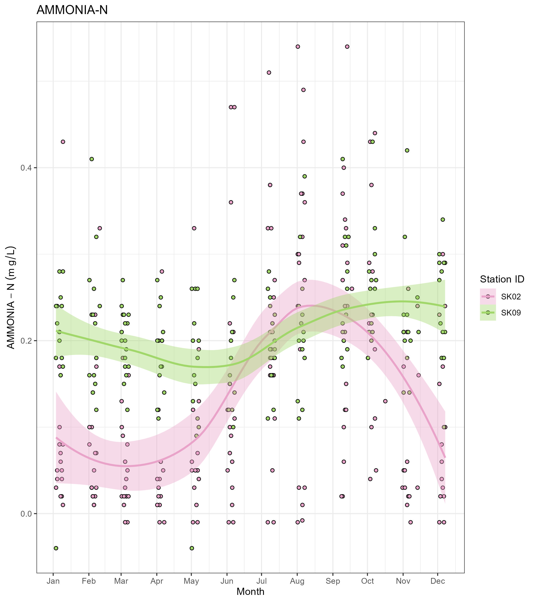
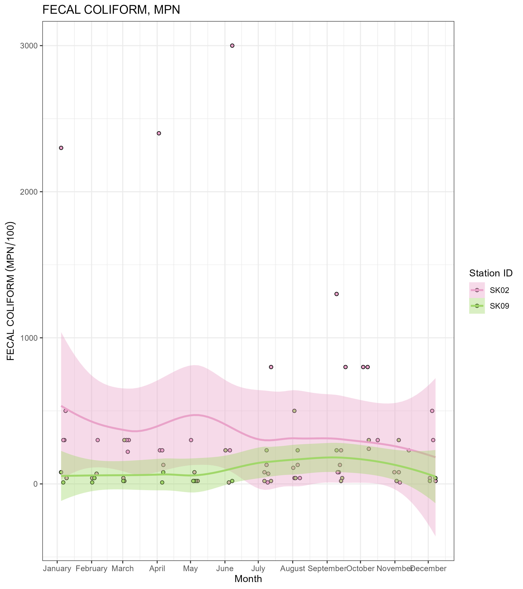

```{r setup, include=FALSE}
knitr::opts_chunk$set(echo = F,warning = FALSE, message = FALSE)
library(kableExtra)
library(readr)
```

## Purpose  
The objective of this report is to provide summarize historical water quality (WQ) and hydrologic data from Snake Creek (C-9 Canal). This summary is intended to be used to infrom the design of the WIPE-OUT water treatment technology testing facility. 


### Intro

Historical WQ data was gathered from two inactive stations on Snake Creek, SK02 and SK09. Station SK09 is located approximately 3 miles upstream of the testing facility and SK02 is located at the outflow of Snake Creek at S29 structure (Figure 1). Unfortunately sampling at these stations was discontinued in 2014 so the data isn't very  current but it is better than no data. The hydrologic record is much more complete and current. Flow from the outflow of the river was measured at S29S and near the head of the river at S30C. All data was downloaded from the SFWMD's publicly available database https://apps.sfwmd.gov/dbhydroInsights/#/homepage on 3/18/2025. Records exist for TP, OPO4, NH4, NOx, and Fecal coliform. No records were found for TDP or chlorophyll-a, analytes which are to be measured in the study. Measurements of pH, Temp, SpCond, and DO are available for analysis if needed but not included in this document. 


```{r figure_1,echo=FALSE, fig.cap="Monitoring Stations on Snake Creek"}
knitr::include_graphics("./Figures/Snake Creek Sampling Map.jpg")

```


### Water quality summary


```{r Table 1, echo=FALSE }
knitr::kable(read_csv("Data/Snake_Creek_WQ_summary.csv"),caption = "Table 1: Summary Stats of SK09 and SK02") %>% kable_material(c("striped", "hover"))
```

### Flow summary

Higher flow rates were measured at S29C which makes sense as it is furthest downstream. Flow at treatment facility will be somewhere in the middle.  

```{r Table 2, echo=FALSE }
knitr::kable( read_csv("Data/Snake_Creek_Flow_Summary.csv"),caption = "Table 2: Summary Stats of flow data from S29S and S30C") %>% kable_material(c("striped", "hover"))
```


### Seasonal patterns in flow

Flow at S29C had typical seasonal pattern with higher flow during wetseason (Fig 1). Surprisingly the highest daily average flows from S30C occurred during the dry season. 


```{r figure_2, echo=FALSE,fig.cap=""}

```

### Total phosphorus

Total phosphorus concentrations are very low all year in Snake Creek, with typical values less than 0.15 mg/L at both stations (Fig 3). There was a slight seasonal pattern, TP  increased from 0.008 to 0.13 mg/L at SK02 near where Snake Creek discharges into the intracoastal waterway in the wet season with a peak in September October and a minimum in February. Minimal seasonal trends were found at SK09.   

```{r figure_3, echo=FALSE,fig.cap=""}

```

No relationship evident between TP and flow for either station (Fig 4). 


```{r figure_4, echo=FALSE,fig.cap=""}
knitr::include_graphics("./Figures/TP vs Flow.jpeg")
```

### Orthophosphate

OPO4 values were mostly below detection limits. There were few higher values in summer months that give impression of a slight seasonal trend at SK09 but majority of observations were below detection even during this time period (Fig 5). No correlation was observed between flow and OPO4 (not shown). 

```{r figure_5, echo=FALSE,fig.cap=""}
knitr::include_graphics("./Figures/Seasonal OPO4.jpeg")
```

### Nitrogen Forms
Seasonal patterns were found in NOx and NH4 (Fig 6 and 7). No relationship with flow was found with either nitrogen form (not shown). 

```{r figure_6, echo=FALSE,fig.cap=""}

```


```{r figure_7, echo=FALSE,fig.cap=""}

```

### Biological 

No seasonal patterns were obvious in fecal coliform counts (Fig 8). 

```{r figure_8, echo=FALSE,fig.cap=""}

```


